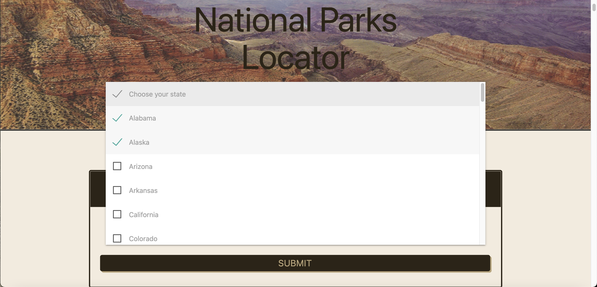
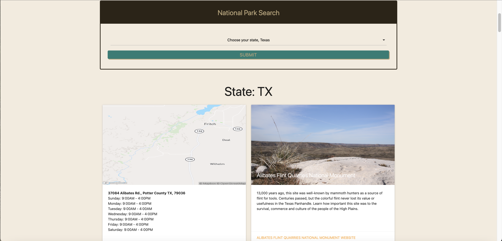
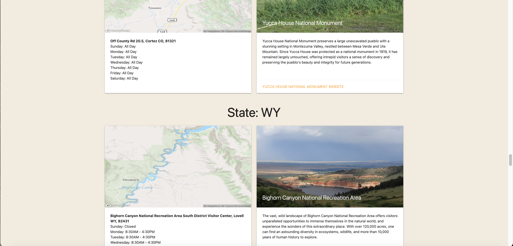

# National-Park-Locator
Project1
## Description
We wanted to create a website that reflected a passion for the outdoors and so that people that share those passions have a useful website to find National Park information in one place. Thus the National Parks Locator was created.
The National Parks Locator is a useful information hub for park enthusiasts. Through the dropdown menu you can choose the state(s) that you are interested in and the results will pull up all the National Parks in the state(s) selected. In the following image, you can see the dropdown in action.

Results will be displayed once the state(s) have been chosen that include information on locations, hours of operation, a summary of each National Park, as well as a link to the National Park website. In the following image you can view the results appear once state is selected.

States will be divided with a header if multiple states are selected. In the following image you can view the header section between the states results.

## Mock up
Visit the [National Park Locator](https://hmustain.github.io/National-Park-Locator/) to see  it in action.
## Roadmap
Website is still in development and will continue to grow with adding further functionality and information.
Version 2 will include additional information such as activities(camping, fishing, hiking, etc..) and an About Us(Group FourLoop) section.
Other possible updates in version 2 will include wildlife, weather, and fees.
## Authors and acknowledgment
Thanks to the help of [Mapbox](https://www.mapbox.com/) and [National Parks](https://www.nps.gov/subjects/developer/api-documentation.htm) API's for providing information, allowing us to create the National Park Locator. The National Park Locator was created using [Materialize](https://materializecss.com/), CSS, HTML, and JavaScript.
Contributing creators - Lydia Dudrey, Hunter Mustain, and Abran Rodriguez Jr.
## License
MIT License